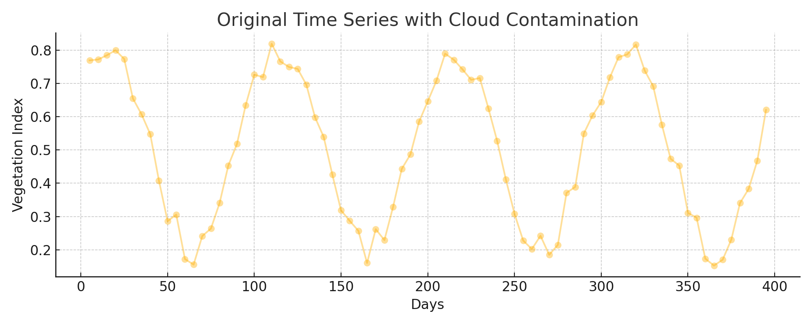
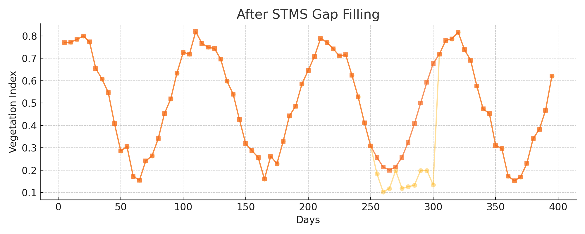

### 🖼️ Visual Results on Simulated Data

#### 📌 Original Time Series with Cloud Contamination

#### 📌 After STMS Gap Filling

#### 📌 Final STMS Result (Smoothed)

## 🖼️ Visual Example from Simulated Data

These plots show the reconstruction process step-by-step:

### Original Time Series (Cloudy)

### After STMS Gap Filling

### Final STMS Result (Smoothed)

