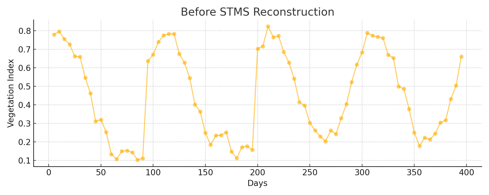
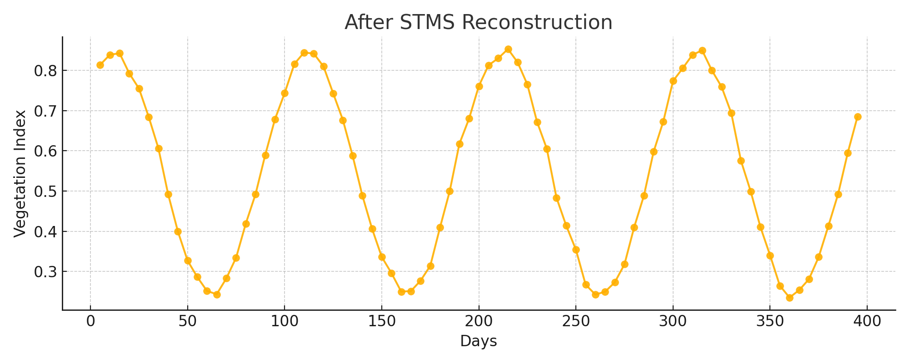
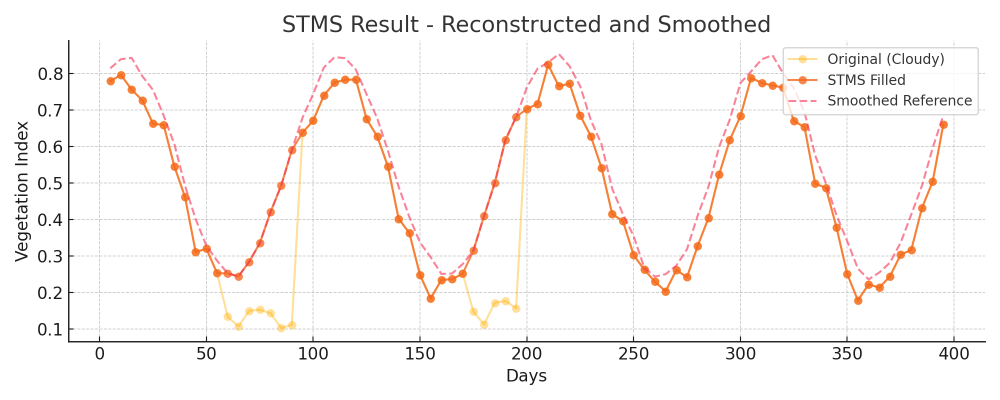

# STMS-Filler

Spatiotemporal Filling and Multistep Smoothing (STMS) is a method to reconstruct satellite time series affected by cloud contamination. This tool helps recover missing values based on spatial similarity and temporal smoothing.

## Installation

```bash
pip install git+https://github.com/byususen/stms.git
```

## Usage

```python
from stms import stms

filler = stms()
vi_filled = filler.spatiotemporal_filling(...)
vi_smoothed = filler.multistep_smoothing(...)
```


## 📊 Example Output

Below is an example of STMS reconstruction and smoothing for one sample:


## 📊 Example Output

### Before Reconstruction
Cloudy and missing values cause noise and gaps.



### After STMS Reconstruction & Smoothing
Cloud-induced gaps are filled and smoothed using spatiotemporal information.




## 📊 Example Output

### Before Reconstruction
Cloudy and missing values cause noise and gaps.


### After Smoothing
Temporal noise is reduced using GAM smoothing.


### STMS Result (Reconstructed + Smoothed)
Cloudy gaps are filled using spatiotemporal similarity and smoothed over time.


